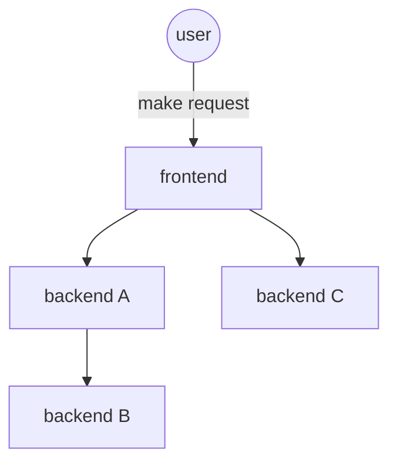

# ResilienceBench-Operator

ResilienceBench-Operator is a Kubernetes-native tool designed to automate resilience experiments in microservice applications. It enables engineers and researchers to define and execute fault injection scenarios directly on services running in Kubernetes clusters.

The tool builds on the original [ResilienceBench](https://github.com/ppgia-unifor/resilience-bench), expanding it to real-world deployments through a declarative, CRD-based approach. It orchestrates experiments that test patterns such as Retry and Circuit Breaker under realistic load and fault conditions.

## Documentation map

Start here when changing or running the project:

- [AGENTS.md](AGENTS.md): implementation rules and project conventions for agents and LLMs.
- [LOCAL_RUN.md](LOCAL_RUN.md): local kind setup, build and deployment commands.
- [docs/README.md](docs/README.md): documentation index.
- [docs/heuristicas-de-selecao.md](docs/heuristicas-de-selecao.md): scenario selection strategies and adaptive heuristic behavior.
- [docs/resultados-e-cache.md](docs/resultados-e-cache.md): result files, S3 storage and planned cache/replay behavior.
- [docs/visualizer.md](docs/visualizer.md): local Angular visualizer for heuristic traces and result files.
- [POSSIBILIDADES_HEURISTICAS.md](POSSIBILIDADES_HEURISTICAS.md): backlog of possible heuristic and evaluation improvements.

## Architecture


## Usage scenario

Consider a microservices-based application like the diagram below, where connectors represent communication between services. Each service may be evaluated under different failure possibilities, workload variations and resilience-pattern configurations. In this context, the tool automates scenario generation and execution from a Kubernetes `Benchmark` custom resource.



## Prerequisites

Before you begin development, ensure you have the following prerequisites installed and configured on your system:

- **Java JDK 17**: Required for developing Java applications. Ensure JAVA_HOME is set to the JDK's installation directory.
- **Maven**: Used for project build and dependency management. Verify its installation by running `mvn -v` in your terminal.
- **Docker**: Necessary for building and pushing container images.
- **kubectl**: The Kubernetes command-line tool, used to interact with your Kubernetes cluster.
- **A Kubernetes Cluster**: You need an accessible Kubernetes cluster where the operator will be deployed.

## Project setup for coding

1. Clone the repository and build it:

   ```bash
   git clone https://github.com/cmendesce/resilience-bench-operator.git
   cd resilience-bench-operator/resilience-bench
   mvn clean install
   ```

2. Open it in your preferred code editor.

## Project setup for running

1. Clone the repository to your local machine:

```bash
git clone https://github.com/ppgia-unifor/resilience-bench-operator.git
```

2. Install the CRDs, the operator and one of the samples:

```bash
kubectl apply -f ./crd
kubectl apply -k ./samples/overlays/hipstershop
```

For a full local kind setup, see [LOCAL_RUN.md](LOCAL_RUN.md).

## Visualizer

The client-side run visualizer lives in `resilience-bench/visualizer`. Install it independently with `npm ci`, then use `npm start`, `npm test`, or `npm run build` from that directory. See the [Visualizer README](resilience-bench/visualizer/README.md) for separate Windows and WSL instructions.

## License

This project is licensed under the MIT License. See [LICENSE](LICENSE) for details.
